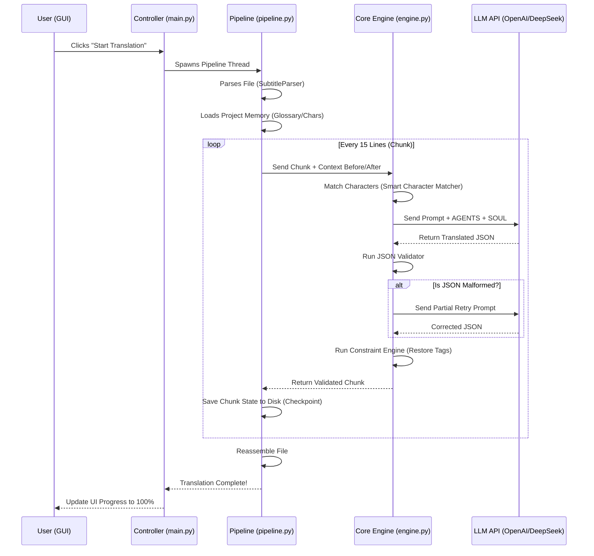

# FlorisSrt - Comprehensive System Architecture & Deep Technical Documentation

This document provides an exhaustive, low-level technical breakdown of **FlorisSrt**, an Agentic Subtitle Translation System. It details the complete architecture, the function of every module, the directory structure, and the algorithm representing the method of work.

---

## 1. Directory Structure

The repository is structured to separate concerns, isolating the GUI from the core logic and agent rules.

```text
FlorisSrt/
├── agents/                           # LLM Strategy & Philosophy Definitions
│   ├── AGENTS.md                     # Base Standard Arabic rules
│   ├── AGENTS_AMMIYA_EGYPTIAN.md     # Egyptian Dialect rules
│   ├── AGENTS_AMMIYA_SAUDI.md        # Saudi Dialect rules
│   ├── AGENTS_AMMIYA_WHITE.md        # Neutral/White Colloquial rules
│   ├── SOUL.md                       # Core Philosophy for literal vs meaning
│   └── SOUL_AMMIYA.md                # Core Philosophy for dialects
├── core/                             # Brain & Engines of the Application
│   ├── chunker.py                    # Splits subtitles & calculates context vectors
│   ├── constraint.py                 # Enforces inline formatting/tag preservation
│   ├── engine.py                     # Main LLM interaction, retry, and validation loop
│   ├── extractor.py                  # Pre-Analyze Agent for characters/terms
│   ├── project_resolution.py         # Path mapping and dynamic folder routing
│   └── validator.py                  # JSON Schema & Segment continuity checker
├── gui/                              # Pure Frontend & UI Services
│   ├── main.py                       # App Controller, QThreads, and Signal Router
│   ├── services.py                   # File I/O, Config saving, atomic writes
│   └── views.py                      # PySide6 Window, Layouts, and Forms
├── parsers/                          # File Handlers
│   └── subtitle_parser.py            # .srt & .ass deserialization and serialization
├── projects/                         # Dynamic Storage (Generated at runtime)
│   └── {Anime_Name}/                 
│       └── data/                     # Project memory (glossary, characters, context)
├── pipeline.py                       # The Orchestrator (Headless Translation Loop)
└── main_app.py / main.py             # App Entry point (loads gui/main.py)
```

---

## 2. The Method of Work (Workflow & Algorithm)

How does a subtitle file move from input to output? The workflow follows an asynchronous, context-aware pipeline.

### Sequence Flow Diagram



### Algorithmic Workflow Step-by-Step

**Step 1: Project Resolution & Initialization**
1. The user inputs a path (e.g., `episode_01.srt`).
2. `project_resolution.py` determines the Project name based on the folder hierarchy.
3. `services.py` loads `glossary.json`, `characters.json`, and `work_context.json` from the target project.

**Step 2: Pre-Analysis (Extractor Flow)**
1. The user initiates Pre-Analyze.
2. `core/extractor.py` reads the file and splits it into large chunks (e.g., 75 lines).
3. The prompt is dynamically built based on the selected **Extraction Mode**:
   - `Balanced`, `Characters Only`, or `Terms Only`.
4. The Extractor extracts data, potentially performing reverse language engineering (Arabic to Romaji) depending on the `translate_result` toggle.
5. Duplicates are merged. The final dataset is presented to the user to save into the Project Memory.

**Step 3: The Translation Loop (`pipeline.py`)**
1. The file is split into chunks of `X` lines (default 15) using `chunker.py`.
2. For each chunk `N`:
   - `chunker.py` looks at chunk `N-1` for `context_before` and chunk `N+1` for `context_after`.
   - `engine.py` receives the chunk. It checks `characters.json`. If "Naruto" is in the English text, "Naruto's" bio is injected into the LLM prompt dynamically.
   - The LLM request is dispatched asynchronously.

**Step 4: The Validation & Constraint Loop**
1. When the LLM responds, `validator.py` checks if all IDs from the input chunk exist in the output JSON.
2. If segments are missing or merged, it triggers the **Partial Retry Mechanism**, sending back the exact missing IDs to the LLM to fix.
3. Once valid, `constraint.py` scans the original English text for tags like `{\an8}`. If the LLM omitted them, the constraint engine forcibly reinstates them onto the Arabic translation to prevent video playback errors.

**Step 5: Checkpointing & Term Memory Tracking**
1. The verified translation is stored.
2. The `pipeline.py` saves a local `.json` state file for that chunk. If the app crashes, it resumes exactly from this chunk.
3. If the LLM declared new `terms_detected` in the JSON, they are saved to `term_memory.json` to enforce translation consistency for future chunks and episodes.

**Step 6: Reassembly**
1. Once all chunks are completed, `subtitle_parser.py` iterates over the serialized objects and rewrites them into a native `.srt` or `.ass` file format.

---

## 3. Core Modules Deep Dive

### 3.1 `core/engine.py` (TranslationEngine)
This is the heart of the system.
- **Fault Tolerance (Circuit Breaker & Exponential Backoff)**: 
  - Tracks `consecutive_failures`. If it hits 5 (e.g., due to Rate Limits or server outages), `circuit_open` is triggered, halting execution for 60 seconds to cool down the API.
  - Implements an exponential backoff (`2^attempt` seconds) on network errors.

### 3.2 `core/extractor.py` (ExtractorEngine)
This is the **Pre-Analyze Agent**.
- Modifies its internal prompt based on the user's `Mode` selection to save tokens.
- Captures `prompt_cache_hit_tokens` from APIs like DeepSeek to log cache savings.

### 3.3 `core/validator.py` (JSONValidator)
Because LLMs hallucinate structurally (merging sentences, skipping lines), the Validator acts as a strict firewall.
- Generates **Retry Prompts** dynamically (e.g. "You missed ID 21 and 23. Do not omit them").

### 3.4 `core/constraint.py` (ConstraintEngine)
Ensures formatting tags (`{\i1}`) are strictly preserved.

### 3.5 `core/chunker.py` (ChunkManager)
Provides sliding window context (`context_before` and `context_after`) without forcing the LLM to translate the context, drastically improving pronoun and gender accuracy.

---

## 4. Agent Prompts Layer (`agents/`)
- **`AGENTS.md`**: Modern Standard Arabic (Fusha) rules.
- **`AGENTS_AMMIYA_WHITE.md`**: Neutral colloquial.
- **`AGENTS_AMMIYA_EGYPTIAN.md`**: Egyptian street slang and cultural idioms.
- **`AGENTS_AMMIYA_SAUDI.md`**: Saudi conversational dialect.
- **`SOUL.md`**: Priority of meaning over literal translation.

---

## 5. Graphical User Interface (`gui/`)
### 5.1 `gui/views.py` (The View)
Pure PySide6 declarations (RunTab, AnalyzeTab, DataEditorTab, SettingsTab).

### 5.2 `gui/services.py` (The Services)
Handles atomic filesystem writes (`.tmp` to actual file) to prevent memory corruption during abrupt process terminations.

### 5.3 `gui/main.py` (The Controller)
Manages **`RunnerWorker`** and **`ExtractorWorker`** as non-blocking QThreads. Synchronizes Provider API keys dynamically without persistent data loss.
